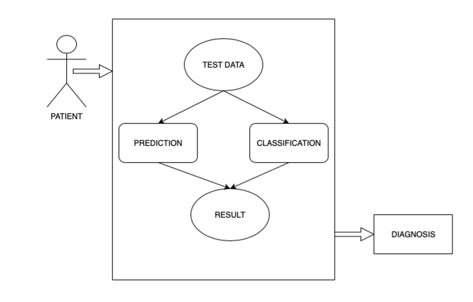
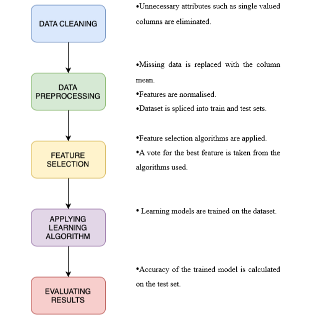
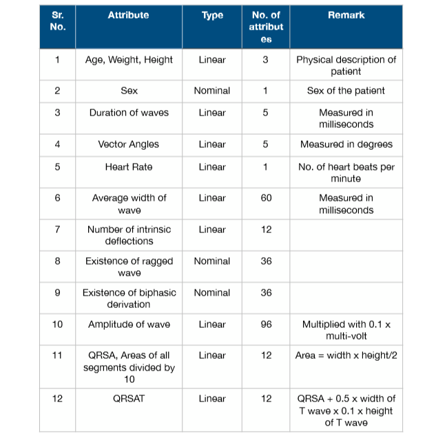
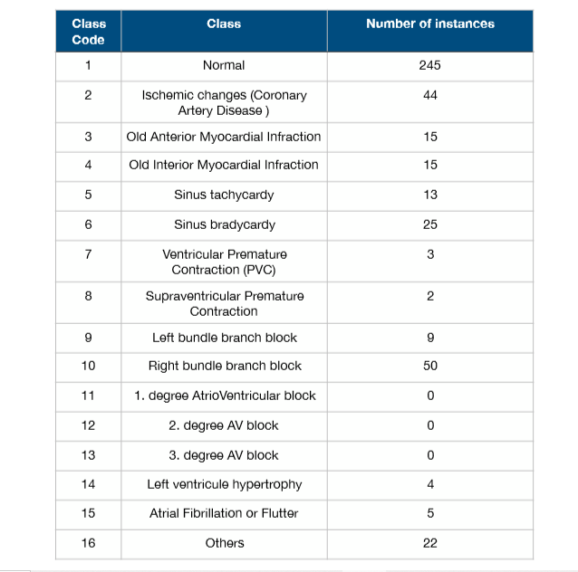
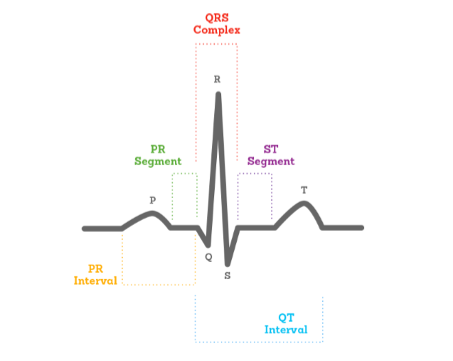
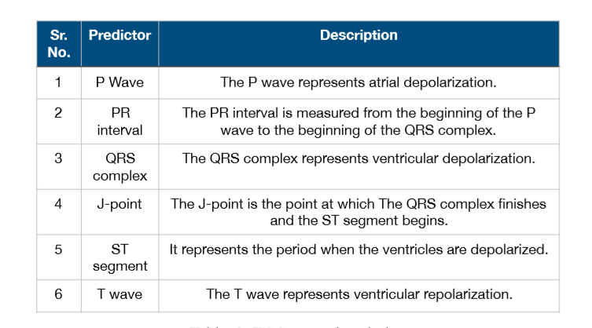
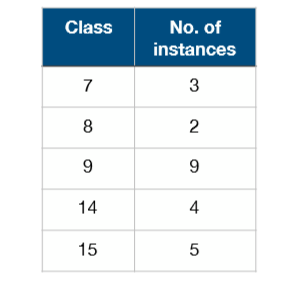
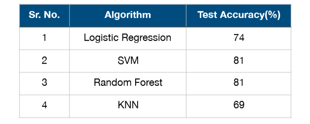
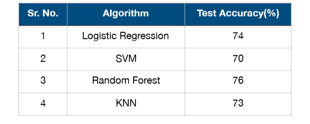

# Prediction and Classification of Cardiac Arrhythmia

#  Problem Statement 

Diagnosis of arrhythmia can be some times difficult. Some arrhythmias are harmless while others can prove to be fatal. Doctors study the ECG of a patient to find whether a patient is suffering from any kind of arrhythmia or not. So the aim is to make this process more swift and smooth by making use of machine learning. But without good accuracy prediction and classification will do no good. Hence it is extremely important to correctly classify arrhythmias as it can be a matter of life and death.

#  Significance of the Problem 

Prediction of cardiovascular diseases is tricky, it should be accurate. There is no space for error be it human or machine error. Many intelligent automated decision support system has been implement to tackle the problem. Most of them are based on contemporary machine learning techniques which provide below average performances. Which is not too tolerable in the field of medical where it can be a matter of life and death. Thus better solution approaches are need of the hour. 

#  Comparison of Existing Approaches to the Problem Framed 

Many decision support systems have been implemented for prediction and classification of cardiac arrhythmia using different learning models. We have implemented few of the supervised machine learning techniques resulting in astonishing outcomes in some cases. In paper 3 accuracies obtained for SVM and random forest are 66% and 72% respectively whereas for the same algorithms we were able to get accuracies of 70% and 76% respectively.

#  Modeling and Implementation Details 

##  Design Diagrams 

## 1. Use Case Diagram

## 2. Flow Diagram

## 3.  Implementation Details and Issues 

The dataset consists of ECG readings and a few physical description of 451 patients. There are a total of 279 attributes, 206 linear and 73 nominal and a single output which is categorical. Each patient is classified into one of the 16 classes based on their attributes. 
Table.

In table 2 describes all the class labels and their number of instances present in the original dataset. Form the table it can be inferred that number of instances for non-arrhythmia classes is very less as compared to the arrhythmia class. 

## 4. ECG Wave 

ECG wave, its components and the meaning of each component of the wave is shown below.

# Steps taken for the implementation of the proposed solution are as follows: 

## STEP 1: 
Dataset is imported using the pandas library. As the first step of data cleaning all the single valued columns are found and removed. These columns are removed as they will provide no variation to the output as the remain same for each and every instance. 17 attributes were found to have same value for all the data points. 

## STEP 2:
In the next step, missing values from the dataset were identified. 5 columns were observed to have missing values. 

The columns J_Angle and P_Angle were deleted as the had significantly large number of missing values. 

## STEP 3:
The remaining missing values in the columns T_Angle, QRST_Angle and Heart were filled by the mean of the respective columns.

## STEP 4:
The dataset is then split into train and test sets with a ratio of 80 to 20. The features are scaled using Standard Scaler module of Scikit-learn library. The standard score of a sample x is calculated as: 
                                            z = (x - u) / s  
where, u is the mean of the training samples and s is the standard deviation f the training samples. 

## STEP 5: 
It is observed that classes 7, 8, 9, 14 and 15 had extremely low instances which are not enough for a good classification. Thus these cases are deleted. Class 16 is also deleted as it contains unlabelled classes. 

## STEP 6: 
In this step recursive feature elimination feature selection algorithms is applied to the dataset namely to select most important features for prediction. 60 features are selected in this step. 

## STEP 7:
Logistic Regression, SVM, Random Forest and KNN algorithms are applied to the processed dataset in this step. Prediction and classification models are learned separately. 

## STEP 8:
Accuracies of the models are analysed to find the best algorithm for prediction and classification. 

# Implementation Issues 
1.  Low accuracy on unprocessed data. 
2.  Many irrelevant attributes, explaining no variation between data points and response. 
3.  Few columns with extremely large  umber of missing values. 
4.  Number of attributes being very large, it was difficult to plot relation between them. 

# Test Cases

To test how well  the prediction and classification algorithms are performing on the cardiac arrhythmia data the dataset is split into train and test sets in the ratio of 8 : 2. 

## 1. Prediction

## 2. Classification

#  Limitations of the Solution 

The system performed well for prediction of arrhythmia, and results were above average for classification. But still classification model couldn’t classify many of the arrhythmia classes correctly. 

# Conclusion

The aim of this project was to detect and classify cardiac arrhythmia. With the given given data which is highly imbalanced and heavily biased towards class 1, obtaining a very accurate classification of all arrhythmia classes is not feasible. But since we have managed to obtain a descent model with descent accuracy, it can be conclude that he model will definitely perform better if trained on a bigger at a set hat has more number of rare class instances. It is observed that personal characteristics such as age, weight, height etc did not make any considerable contribution to the classification. As only the ECG readings are used as features, adding other features that a medical professional may utilize n his diagnosis may improve the performance of the model.

# Future Scope

More feature, important according to a medical professional, can be added to the dataset to obtain a better accuracy. Other models can also be tested on the dataset, and ensemble of models can be made. As the prediction accuracy is much better than classification accuracy, prediction model can be used as a decision support system that may guide the professionals in confirming the presence of arrhythmia with a fairly high certainty. For this project only the physical description and ECG extracted data is used as features. Processing the ECG wave itself can prove to be beneficial to obtain even more features that might add to the accuracy of the existing models. 

# References

 1. Anuradha, B., and V. C. Reddy. "CARDIAC ARRHYTHMIA CLASSIFICATION 
    USING FUZZY CLASSIFIERS." 2008 Journal of  Theoretical & Applied Information 
    Technology. 

 2. Gupta, Vasu, Sharan Srinivasan, and Sneha S. Kundli."Prediction and Classification of 
    Cardiac Arrhythmia." 2014 International Conference on Automatic Control and Dynamic 
    Optimization Techniques (ICACDOT). IEEE.

 3. Kelwade, J. P., and S. S. Shankar."Comparative study of neural networks for prediction 
    of cardiac arrhythmias." 2016 International Conference on Automatic Control and 
    Dynamic Optimization Techniques (ICACDOT). IEEE. 
 
 4. Kelwade, J. P., and S. S. Shankar. "Radial basis function neural network for prediction of 
    cardiac arrhythmias based on heart rate time series." 2016 IEEE First International 
    Conference on Control, Measurement, and Instrumentation (CMI). IEEE.

 5. Liang Lijun, Jin Tingting, Huo Meiya.“Feature identification  from imbalanced datasets 
    for diagnosis of Cardiac Arrhythmia.” 2018 11th International Symposium on 
    Computational Intelligence and Design.

 6. S. Babichev, V. Lytvynenko, V. Osypenko “Implementation of the Objective Clustering 
    Inductive Technology Based on DBSCAN Clustering Algorithm.” 2017 12th 
    International Scientific and Technical Conference on Computer Sciences and Information 
    Technologies (CSIT).

 7. THARA SOMAN PATRICK O. BOBBIE “Classification of Arrhythmia Using Machine 
    Learning Techniques.” 2018 Engineering Vibration, Communication and Information 
    Processing.

 8. Maya Mitra, R. K. Samanta “Cardiac Arrhythmia Classification Using Neural Networks 
    with Selected Features.” 2013 International Conference on Computational Intelligence: 
    Modeling Techniques and Applications (CIMTA) . 
 
  
